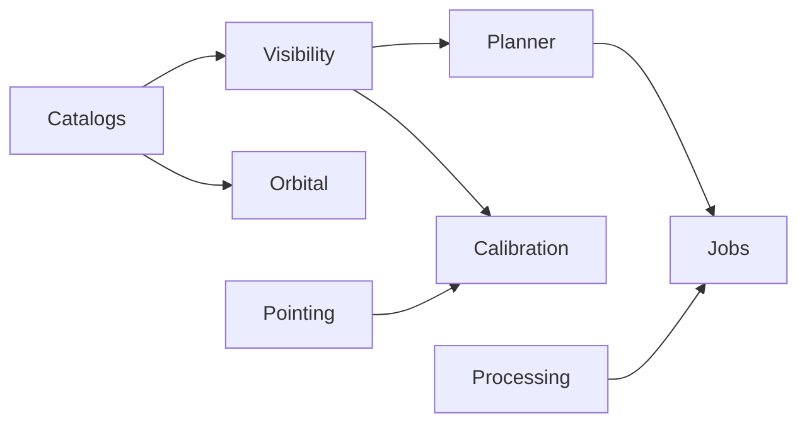

# Astronomy Engine

```mermaid
flowchart LR
  Catalogs --> Visibility --> Planner
  Catalogs --> Orbital
  Visibility --> Calibration
  Pointing --> Calibration
  Processing --> Jobs
  Planner --> Jobs
```

The astronomy engine is a pure Python library. It keeps scientific logic offline-capable, hardware-agnostic, and testable on CI.
